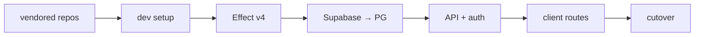

# Corehalla → kubi (dair.gg) migration overview

Kubi is a rewrite of [corehalla](https://github.com/djobbo/corehalla) (`next` branch, vendored at `.repos/corehalla`) onto **Effect + TanStack Start + Drizzle PostgreSQL**. The backend is largely ahead of the client; several subsystems are half-migrated or still wired to the old stack.

Reference implementation: `.repos/corehalla`  
Target stack: this monorepo (`apps/api`, `apps/client`, `apps/workers`, `packages/db`, …)

## Current state (May 2026)

| Area                | Status             | Notes                                                                                                                               |
| ------------------- | ------------------ | ----------------------------------------------------------------------------------------------------------------------------------- |
| Brawlhalla HTTP API | **Mostly done**    | Contract + handlers in `packages/api-contract`, `apps/api`                                                                          |
| Background crawlers | **Done**           | `apps/workers` (leaderboard + full player crawl via API)                                                                            |
| Client UI           | **Early**          | Home stub, player profile, **1v1/2v2 rankings**; legends/weapons tabs still missing                                                |
| Toolchain           | **Mostly done**    | `vp` + `vp staged` pre-commit; see [07-vite-plus-toolchain.md](./07-vite-plus-toolchain.md)                                           |
| Dev setup           | **Fixed (local)**  | `vp run setup` uses compose + drizzle; needs Postgres on `DATABASE_URL`                                                             |
| Effect version      | **Done (2b)**      | `vp run check:types` green; `Context.Service`, no zod, `defineRelations` — [02-effect-v4-remaining.md](./02-effect-v4-remaining.md) |
| Legacy data         | **Started**        | `apps/migrator` aliases + bookmarks (Effect Schema); needs Supabase creds to run                                                    |
| Bookmarks schema    | **PG in @dair/db** | `@dair/schema` removed; relations in [packages/db/src/relations.ts](../packages/db/src/relations.ts)                                |

## Phased plans

Execute in order where dependencies apply. Each phase has its own doc.

| Phase  | Doc                                                      | Goal                                                     | Blocks                         |
| ------ | -------------------------------------------------------- | -------------------------------------------------------- | ------------------------------ |
| **0**  | [vendored-repos.md](./vendored-repos.md)                 | Local upstream clones for debugging                      | —                              |
| **0b** | [07-vite-plus-toolchain.md](./07-vite-plus-toolchain.md) | `vp` + pnpm aligned with `.repos/vite-plus`              | Phase 1                        |
| **1**  | [01-dev-setup.md](./01-dev-setup.md)                     | One-command dev bootstrap (`vp run setup`)               | Phase 0b                       |
| **2**  | [02-effect-v4.md](./02-effect-v4.md)                     | Align runtime + `@effect/*` on Effect v4 (`effect-smol`) | Setup scripts, new Effect code |
| **2b** | [02-effect-v4-remaining.md](./02-effect-v4-remaining.md) | API typecheck: Context.Service, Schema, no Zod           | Phases 4–6                     |
| **3**  | [03-supabase-to-pg.md](./03-supabase-to-pg.md)           | Move production/user data off Supabase                   | Auth, favorites, aliases       |
| **4**  | [04-api-and-auth-parity.md](./04-api-and-auth-parity.md) | Close API gaps vs corehalla tRPC                         | Client features needing data   |
| **5**  | [05-client-routes.md](./05-client-routes.md)             | TanStack Start routes ≈ corehalla UX                     | Phases 3–4 for bookmarks/auth  |
| **6**  | [06-cutover-and-ops.md](./06-cutover-and-ops.md)         | Deploy, DNS, deprecate corehalla                         | Phases 1–5                     |



Phase 2 and 3 can overlap **after** setup runs on a pinned Effect version (see [02-effect-v4.md](./02-effect-v4.md) § “Parallel work”).

## Parity matrix (corehalla vs kubi)

```
                    Corehalla    Kubi API    Kubi client    Notes
──────────────────────────────────────────────────────────────────
Player profile         ✓            ✓           partial      legends/weapons tabs missing
Ranked 1v1/2v2         ✓            ✓           partial      client routes live
Rotating ranked        ✗            ✓           ✗            kubi-only API
Global rankings        ✓            ✓           ✗
Clan rankings          ✓            ✗ (TODO)    ✗            contract comment L137
Clan profile           ✓            ✓           ✗
Power rankings         ✓            ✓           ✗
Weekly rotation        ✓            ✓           ✗            home not built
BH articles            ✓            ✓           ✗
Search                 ✓            ✓           partial      guild branch not wired
Favorites/bookmarks    ✓            service     ✗            no HTTP + no route
Auth/session           Supabase     stub        ✗            real session TODO
Glory calculator       ✓            —           ✗            client-only
Discord bot            ✓            —           —            out of scope unless requested
```

## Out of scope (unless product asks)

- **Discord channel-switcher bot** (`corehalla/worker/src/appa-bot/`) — separate service
- **Supabase as runtime DB** — only as **migration source**, not dev dependency
- **Short URLs** `/p/:id`, `/c/:id` — optional redirects later

## Definition of done

1. `vp run setup` brings up Postgres + Redis, migrates schema, syncs `.repos/`, prints dev URLs.
2. `vp run check:types` and `vp run test` pass on Effect v4.
3. Migrator can run idempotently: aliases, users/oauth, bookmarks, and optionally latest snapshot rows from `BHPlayerData` / ranked tables where still valuable.
4. Client covers corehalla’s primary flows: rankings, player (all tabs), clan, favorites, home feed, search (player + guild).
5. Production runs on on-prem PG + Redis; Supabase decommissioned for app data.

## Tracking

Use GitHub issues or checkboxes inside each phase doc. When a phase completes, link the PR and mark the row in this table.
