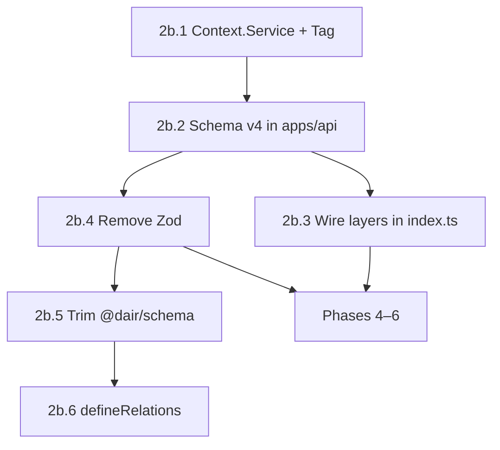

# Phase 2b: Effect v4 — remaining API blockers

**Goal:** `vp run check:types` green for `@dair/api`, `@dair/workers`, `@dair/client`, and `@dair/migrator` on **Effect `4.0.0-beta.71`** with **no Zod** in active code paths.

**Parent:** [02-effect-v4.md](./02-effect-v4.md)  
**Blocks:** [04-api-and-auth-parity.md](./04-api-and-auth-parity.md), [05-client-routes.md](./05-client-routes.md), [06-cutover-and-ops.md](./06-cutover-and-ops.md)

## Status (May 2026)

| Workstream | Status | Notes |
|------------|--------|-------|
| Catalog / install | **Done** | `effect@4.0.0-beta.71`, `@effect/platform-node`, `@effect/sql-pg`, `@effect/atom-react`, Drizzle `1.0.0-rc.1` |
| Import paths (`@effect/platform` → `effect/unstable/*`) | **Done** | API, workers, setup, api-contract |
| `@dair/api-contract` HttpApi v4 | **Done** | `tsgo --noEmit` clean |
| Client Atom | **Done** | `effect/unstable/reactivity` + `@effect/atom-react` hooks |
| `apps/api` typecheck | **Done** | `vp run -F @dair/api check:types` green (May 2026) |
| Zod removal | **In progress** | `brawlhalla-api` + migrator bookmarks clean; `@dair/schema` still uses zod |
| Drizzle `defineRelations` | **Shimmed** | `drizzle-orm/_relations` — replace later |

## Recommended order



1. **Context.Service** — largest error bucket; unblocks handlers and layers.
2. **Schema v4 in `apps/api`** — brawlhalla schemas, helpers, gql.
3. **Layer renames** — `Foo.Default` → `Foo.layer` at composition root.
4. **Zod** — parallel once API types stabilize; migrator last.
5. **`@dair/schema`** — delete or shrink after Zod gone.
6. **`defineRelations`** — optional before prod; shim is fine for typecheck.

## Verification

```bash
vp run check:types                    # all workspaces
vp run -F @dair/api check:types       # API only
vp run -F @dair/api-contract check:types
rg 'from "zod|Effect\.Service|optionalWith|@effect/platform"' apps packages --glob '*.{ts,tsx}'
```

---

## 2b.1 `Effect.Service` → `Context.Service`

**Reference:** `.repos/effect/migration/services.md` (§ `Effect.Service` → `Context.Service` with `make`).

### v3 → v4 pattern

```typescript
// v3
export class Cache extends Effect.Service<Cache>()("@dair/services/Cache", {
  effect: Effect.gen(function* () { /* ... */ }),
}) {
  static readonly layer = this.Default.pipe(Layer.provide(Dep.layer))
}

// v4
import { Context, Effect, Layer } from "effect"

export class Cache extends Context.Service<Cache>()("@dair/services/Cache", {
  make: Effect.gen(function* () { /* same body as v3 effect */ }),
}) {
  static readonly layer = Layer.effect(this, this.make).pipe(
    Layer.provide(Dep.layer),
  )
}
```

| v3 | v4 |
|----|-----|
| `effect:` option | `make:` option |
| `this.Default` | `Layer.effect(this, this.make)` |
| `dependencies: [...]` in service opts | `Layer.provide(...)` on `static layer` |
| `Effect.fn` on methods | Keep `Effect.fn` (unchanged) |

### `Effect.Service` classes (9) — migrate first

| Service | File | Tag |
|---------|------|-----|
| `Database` | [apps/api/src/services/db/index.ts](../apps/api/src/services/db/index.ts) | `@dair/services/Database` |
| `Cache` | [apps/api/src/services/cache/index.ts](../apps/api/src/services/cache/index.ts) | `@dair/services/Cache` |
| `Fetcher` | [apps/api/src/services/fetcher/index.ts](../apps/api/src/services/fetcher/index.ts) | `@app/Fetcher` |
| `BrawlhallaApi` | [apps/api/src/services/brawlhalla-api/index.ts](../apps/api/src/services/brawlhalla-api/index.ts) | `@dair/services/BrawlhallaApi` |
| `BrawltoolsApi` | [apps/api/src/services/brawltools-api/index.ts](../apps/api/src/services/brawltools-api/index.ts) | `@dair/services/BrawltoolsApi` |
| `Archive` | [apps/api/src/services/archive/index.ts](../apps/api/src/services/archive/index.ts) | `@dair/services/Archive` |
| `Authorization` | [apps/api/src/services/authorization/index.ts](../apps/api/src/services/authorization/index.ts) | `@dair/services/Authorization` |
| `BrawlhallaRateLimiter` | [apps/api/src/services/rate-limiter/index.ts](../apps/api/src/services/rate-limiter/index.ts) | `@dair/services/BrawlhallaRateLimiter` |
| `ServerDiscovery` | [apps/api/src/services/server-discovery/index.ts](../apps/api/src/services/server-discovery/index.ts) | `@dair/services/ServerDiscovery` |

- [ ] Convert each class to `Context.Service` + `make`
- [ ] Replace `static readonly layer = this.Default.pipe(...)` with `Layer.effect(this, this.make).pipe(...)`
- [ ] Grep `\.Default` under `apps/api` and update composition in [apps/api/src/index.ts](../apps/api/src/index.ts)

### `Context.Tag` → `Context.Service` (6) — same pass

| Service | File |
|---------|------|
| `DatabaseConfig` | [apps/api/src/services/db/config.ts](../apps/api/src/services/db/config.ts) |
| `ApiServerConfig` | [apps/api/src/services/config/api-server-config.ts](../apps/api/src/services/config/api-server-config.ts) |
| `ClientConfig` | [apps/api/src/services/config/client-config.ts](../apps/api/src/services/config/client-config.ts) |
| `OAuthConfig` | [apps/api/src/services/authorization/config.ts](../apps/api/src/services/authorization/config.ts) |
| `RequestFetchStrategy` | [apps/api/src/services/fetch-strategy/index.ts](../apps/api/src/services/fetch-strategy/index.ts) |
| `Bookmarks` | [apps/api/src/services/bookmarks/index.ts](../apps/api/src/services/bookmarks/index.ts) |

v4 class form: `class X extends Context.Service<X, Shape>()("id") {}` — see `services.md` § Class-Based Services.

- [ ] Migrate config tags to `Context.Service` with `Layer.succeed` / `Layer.effect` test layers
- [ ] Update [AGENTS.md](../AGENTS.md) service examples if still showing `Effect.Service`

### Checklist

- [ ] `rg 'Effect\.Service' apps/api` returns empty
- [ ] `rg 'Context\.Tag' apps/api` returns empty (or only intentional legacy)
- [ ] `vp run -F @dair/api check:types` — TS2551 `Service` / `Default` errors gone

---

## 2b.2 Schema v4 in `apps/api`

**Reference:** `.repos/effect/migration/schema.md`

`@dair/api-contract` is already migrated. Remaining Schema debt lives under **`apps/api/src`** (Brawlhalla decode schemas, helpers, gql).

### Pattern table

| v3 | v4 |
|----|-----|
| `Schema.Literal("a", "b")` | `Schema.Literals(["a", "b"])` |
| `Schema.Literal(...tiers)` | `Schema.Literals([...tiers])` |
| `Schema.Union(A, B)` | `Schema.Union([A, B])` |
| `Schema.Tuple(A, B)` | `Schema.Tuple([A, B])` |
| `Schema.optionalWith(s, { default: () => x })` | `s.pipe(Schema.withDecodingDefaultType(Effect.succeed(x)))` |
| `Schema.optionalWith(s, { exact: true })` | `Schema.optionalKey(s)` |
| `Schema.NonEmptyTrimmedString` | `Schema.NonEmptyString` or `Schema.String.check(Schema.isMinLength(1))` |
| `Schema.greaterThanOrEqualTo(n)` | `Schema.check(Schema.isGreaterThanOrEqualTo(n))` or `.check(...)` on schema |
| `Schema.transformOrFail(from, to, { decode, encode })` | `from.pipe(decodeTo(to, { decode: SchemaGetter.transformOrFail(...), ... }))` |
| `Schema.Schema.Type<typeof S>` | `typeof S.Type` |
| `Schema.decodeUnknown(S)(input)` | `Schema.decodeUnknownEffect(S)(input)` |
| `Schema.TaggedError` | `Schema.TaggedErrorClass` (errors mostly done) |

Shared helper (api-contract): [packages/api-contract/src/shared/schema-helpers.ts](../packages/api-contract/src/shared/schema-helpers.ts) — consider moving to `@dair/common` if API duplicates defaults.

### Files to update

| File | Issues |
|------|--------|
| [apps/api/src/helpers/clean-string.ts](../apps/api/src/helpers/clean-string.ts) | `transformOrFail` |
| [apps/api/src/helpers/number-from-string.ts](../apps/api/src/helpers/number-from-string.ts) | `transformOrFail` |
| [apps/api/src/services/brawlhalla-api/schema/clan.ts](../apps/api/src/services/brawlhalla-api/schema/clan.ts) | `Literal(...)`, `Schema.Schema.Type` |
| [apps/api/src/services/brawlhalla-api/schema/player-stats.ts](../apps/api/src/services/brawlhalla-api/schema/player-stats.ts) | `optionalWith`, types |
| [apps/api/src/services/brawlhalla-api/schema/player-ranked.ts](../apps/api/src/services/brawlhalla-api/schema/player-ranked.ts) | `optionalWith`, `transform` |
| [apps/api/src/services/brawlhalla-api/schema/region.ts](../apps/api/src/services/brawlhalla-api/schema/region.ts) | `transform`, `Union` |
| [apps/api/src/services/brawlhalla-api/schema/tier.ts](../apps/api/src/services/brawlhalla-api/schema/tier.ts) | `transform` |
| [apps/api/src/services/brawlhalla-gql/schema.ts](../apps/api/src/services/brawlhalla-gql/schema.ts) | `NumberFromString` (verify v4 name) |
| [apps/api/src/routes/v1/brawlhalla/get-servers.ts](../apps/api/src/routes/v1/brawlhalla/get-servers.ts) | `Literal("success")` → single literal or `Literals` |
| [apps/api/src/services/middleware/response-cache.ts](../apps/api/src/services/middleware/response-cache.ts) | `Schema.Record({ key, value })` → `Schema.Record(key, value)` |

- [ ] Fix each file; run `vp run -F @dair/api check:types` after brawlhalla-api schema batch
- [ ] `rg 'optionalWith|transformOrFail|NonEmptyTrimmedString|Schema\.Schema\.Type' apps/api` empty

### Already done (do not redo)

- `Schema.TaggedErrorClass` on API error types
- `Schema.decodeUnknownEffect` in authorization, brawlhalla-api, get-servers, server-discovery
- `Effect.catchCause` in [apps/api/src/index.ts](../apps/api/src/index.ts)

---

## 2b.3 Remove Zod

**Policy:** No new Zod. Runtime validation uses **Effect Schema**; shared types use `typeof Schema.Type` or const-derived unions.

### `packages/brawlhalla-api` (14 files)

Zod is used for **types + optional parse**; live decode paths use `apps/api/src/services/brawlhalla-api/schema/*` (Effect).

| Area | Files | Strategy |
|------|-------|----------|
| Constants | `constants/ranked/regions.ts`, `tiers.ts`, `constants/power/*.ts` | `as const` arrays + `export type X = (typeof arr)[number]`; drop `.catch()` — normalize in API layer |
| API shapes | `api/schema/*.ts` | Replace with `export type` interfaces **or** re-export from `@dair/api-contract` / api Brawlhalla schemas |
| HTTP helpers | `api/http.ts` | Commented `z.parse` — delete or use `Schema.decodeUnknownEffect` |

- [ ] Remove `zod` from [packages/brawlhalla-api/package.json](../packages/brawlhalla-api/package.json) (already no dep; delete imports)
- [ ] `rg 'from "zod' packages/brawlhalla-api` empty
- [ ] `vp run -F @dair/brawlhalla-api check:types` if script exists, else root check

### `apps/migrator`

| File | Strategy |
|------|----------|
| [apps/migrator/src/bookmarks.ts](../apps/migrator/src/bookmarks.ts) | Define `BookmarkRow` struct in Effect Schema; `Schema.decodeUnknownEffect` on Supabase JSON rows |

- [ ] Remove `zod` from migrator `package.json` if present
- [ ] `vp run -F @dair/migrator check:types`

### Workers / client

- [ ] `rg 'from "zod' apps packages` — only `@dair/schema` may remain until 2b.4

---

## 2b.4 `packages/schema` (Zod + drizzle-zod)

**Today:** SQLite-era DTOs + `drizzle-zod` helpers; **not imported** by API/client (grep `@dair/schema`).

| File | Uses |
|------|------|
| `src/bookmarks/*.ts` | zod + drizzle-zod + SQLite table defs |
| `src/auth/*.ts` | drizzle-zod |
| `src/archive/*.ts` | drizzle-zod |

**Options (pick one):**

1. **Delete package** — move any still-needed types to `@dair/db` or `api-contract`.
2. **Contract-only** — keep plain TS types; no runtime schema.
3. **Effect Schema** — only if migrator or client still need shared decode (prefer `api-contract`).

- [ ] Confirm zero imports: `rg '@dair/schema' --glob '*.{ts,tsx}'`
- [ ] Remove `zod`, `drizzle-zod` from [packages/schema/package.json](../packages/schema/package.json) and root catalog
- [ ] Update [03-supabase-to-pg.md](./03-supabase-to-pg.md) — mark SQLite `@dair/schema` as removed
- [ ] Remove package from workspace or repurpose as `@dair/legacy-schema` archive

---

## 2b.5 Drizzle `defineRelations` (replace `_relations` shim)

**Today:** [packages/db](../packages/db) uses legacy helper:

```typescript
import { relations } from "drizzle-orm/_relations"
```

**Target (Drizzle 1.0):** central `defineRelations` over full schema — see `drizzle-orm` `defineRelations` / `defineRelationsPart` in installed `1.0.0-rc.1`.

### Tables with `relations()` today (9 files)

- [packages/db/src/schema/auth/bookmarks.ts](../packages/db/src/schema/auth/bookmarks.ts)
- [packages/db/src/schema/auth/users.ts](../packages/db/src/schema/auth/users.ts)
- [packages/db/src/schema/auth/sessions.ts](../packages/db/src/schema/auth/sessions.ts)
- [packages/db/src/schema/auth/oauth-accounts.ts](../packages/db/src/schema/auth/oauth-accounts.ts)
- [packages/db/src/schema/archive/brawlhalla/player-history.ts](../packages/db/src/schema/archive/brawlhalla/player-history.ts)
- [packages/db/src/schema/archive/brawlhalla/player-history-relations.ts](../packages/db/src/schema/archive/brawlhalla/player-history-relations.ts)
- [packages/db/src/schema/archive/brawlhalla/player-legend-history.ts](../packages/db/src/schema/archive/brawlhalla/player-legend-history.ts)
- [packages/db/src/schema/archive/brawlhalla/player-weapon-history.ts](../packages/db/src/schema/archive/brawlhalla/player-weapon-history.ts)
- [packages/db/src/schema/archive/brawlhalla/clan-history.ts](../packages/db/src/schema/archive/brawlhalla/clan-history.ts)

### Steps

- [ ] Read Drizzle 1.0 relation docs / examples in `.repos/drizzle-orm` (refresh vendored if needed)
- [ ] Add [packages/db/src/relations.ts](../packages/db/src/relations.ts) (or `schema/relations.ts`) with `defineRelations(schema, (r) => ({ ... }))`
- [ ] Remove per-table `export const fooRelations = relations(...)` blocks
- [ ] Pass relational config into `PgDrizzle.make` if query API requires it
- [ ] `rg 'drizzle-orm/_relations' packages/db` empty
- [ ] `vp run check:types` for workspaces that import `@dair/db`

**Note:** Shim is acceptable for Phase 2 completion; do this before relying on Drizzle relational `db.query.*` in new features.

---

## 2b.6 Unblocks Phases 4–6

Do **not** start feature work until `apps/api` typechecks. Then:

| Phase | Doc | Blocked by 2b |
|-------|-----|----------------|
| **4** | [04-api-and-auth-parity.md](./04-api-and-auth-parity.md) | Context.Service on `Bookmarks`, `Authorization`; HttpApi handlers compile |
| **5** | [05-client-routes.md](./05-client-routes.md) | Stable `Api` + `AtomHttpApi` client; no Zod in shared packages |
| **6** | [06-cutover-and-ops.md](./06-cutover-and-ops.md) | Full monorepo `check:types` + `vp run test` |

### Phase 4 — quick pointer

- Clan rankings contract TODO, bookmarks HTTP routes, real OAuth session — all need green API build.

### Phase 5 — quick pointer

- Player route already uses `AsyncResult.builder`; add routes per [05-client-routes.md](./05-client-routes.md) route map.

### Phase 6 — quick pointer

- Staging rehearsal requires migrator (2b.3) + workers on Effect v4.

---

## Definition of done (Phase 2b)

- [x] `vp run check:types` passes for all workspaces in `turbo.json` (api, workers, migrator, api-contract)
- [ ] No `effect@3` or `@effect/platform` (non-node) in lockfile
- [ ] No `zod` / `drizzle-zod` in catalog or active package imports
- [ ] `rg 'Effect\.Service|from "zod|@effect/platform"' apps packages scripts` clean (except docs/comments)
- [ ] [02-effect-v4.md](./02-effect-v4.md) checkboxes updated; this doc sections checked off
- [ ] AGENTS.md Effect row says v4 + `Context.Service` pattern

## Error budget (last known)

When `@dair/api-contract` was green but `@dair/api` was not (~468 errors), top codes were:

| Code | Likely cause |
|------|----------------|
| TS2551 | `Effect.Service`, `decodeUnknown`, `optionalWith` |
| TS2339 | Broken inference when `Api` / services unresolved |
| TS7006 / TS18046 | Cascade from failed service types |
| TS2307 | Subpath exports (fixed in api-contract `package.json` exports) |

Re-run after 2b.1–2b.2 to confirm bucket is empty.
